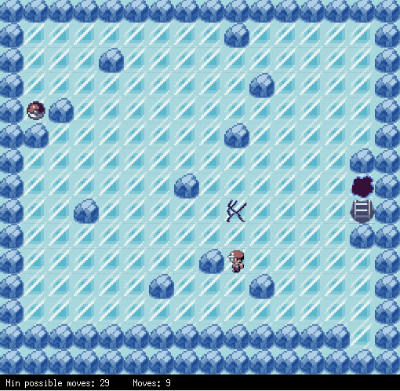
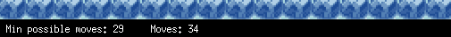
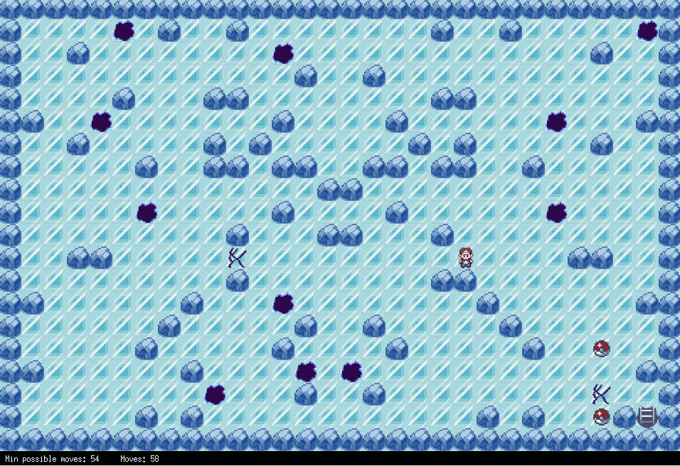
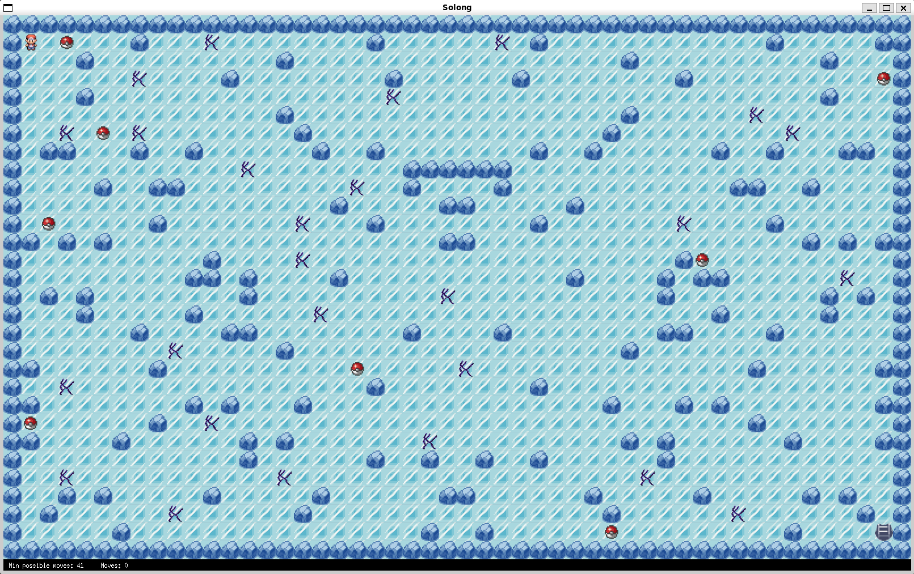

*This project has been created as part of the 42 curriculum by blamotte.*

# Solong - Ice Path Edition


> *Aperçu de la traversée d'un niveau complexe montrant la physique de glisse.*

## Description

**Solong** est un jeu d'énigmes en 2D développé en C avec la bibliothèque **MiniLibX**.

Le gameplay puise son inspiration directe dans la célèbre **Route de Glace** (*Ice Path*) des versions Pokémon Or et Argent sur GameBoy Color. Le joueur évolue sur une surface glissante : chaque impulsion le fait glisser de manière ininterrompue jusqu'à ce qu'il rencontre un mur ou un obstacle. Ce puzzle, qui a marqué toute une génération par sa difficulté, a été ici reproduit dans sa forme originale, avant d'être simplifié dans les versions ultérieures.

Pour ce projet, j'ai choisi de dépasser largement les attentes du sujet de base en intégrant des mécaniques avancées qui transforment le jeu en un véritable défi logique :

* **Physique de glisse intégrale** : Le mouvement est géré par des boucles de collision, simulant une inertie parfaite sur la glace.
* **Glace fragile (`?`)** : Des dalles qui se brisent immédiatement après votre passage.
* **Obstacles mortels (`!`)** : Des trous béants, naturels ou créés par l'effondrement de la glace, qui terminent la partie si vous vous y arrêtez.
* **Système de progression non-linéaire** : L'ordre de ramassage des objets et la gestion de l'environnement sont cruciaux pour ne pas se retrouver bloqué sans issue.

---

## L'Intelligence du Jeu : Le Solver

Le sujet 42 demande au joueur de terminer le niveau avec le moins de coups possible. Là où la plupart des projets se contentent de compter les pas, mon **Solong** calcule la perfection.

Au lancement, un algorithme de résolution analyse la carte et détermine le **nombre de mouvements minimum** pour ramasser tous les objets et atteindre la sortie. Ce chiffre est affiché en temps réel dans l'interface, mettant le joueur au défi d'égaler le score théorique de la machine.


> *L'interface affiche le nombre de coups actuels face au record théorique calculé par le solver.*

### Détails techniques de l'algorithme

* **BFS (Breadth-First Search)** : Le programme explore l'intégralité des combinaisons possibles pour garantir que le chemin trouvé est mathématiquement le plus court.
* **State-Space Search (Espace d'états)** : Contrairement à un simple pathfinding, l'algorithme n'explore pas seulement des positions , mais des **états complets**. Un état est défini par la position du joueur, l'inventaire actuel (objets ramassés) et l'état des dalles de glace déjà brisées.
* **Bitmasking (Optimisation Mémoire)** : Pour gérer jusqu'à 256 objets ou dalles fragiles sans ralentissement, j'utilise le bitmasking. Chaque élément est représenté par un bit unique dans un tableau de `uint64_t`. Les comparaisons d'états se font par des opérations binaires ultra-rapides.
* **BST (Binary Search Tree)** : Lors de l'exploration, le programme stocke les milliers d'états déjà visités dans un **Arbre Binaire de Recherche**. Cela permet de vérifier instantanément si un chemin a déjà été exploré, avec une complexité en .

---

## Animations et Immersion

Chaque interaction possède son propre cycle d'animation pour renforcer l'aspect visuel "Rétro" du titre :

* **Personnage** : Sprites complets dans les 4 directions de déplacement.
* **Collectibles** : Animation fluide des pokeballs à ramasser.
* **Environnement** : Effets visuels lors de la destruction des dalles fragiles et lors de l'ouverture de la sortie.



---

## Instructions

### Dépendances

Le projet utilise la bibliothèque graphique **MiniLibX**. Pour Linux, installez :

* `X11` (bibliothèques de développement)
* `libbsd-dev`

### Compilation

Un `Makefile` est présent pour gérer la compilation :

* `make` : Compile l'exécutable `so_long`.
* `make clean` / `fclean` : Nettoyage des fichiers objets et de l'exécutable.
* `make re` : Relance une compilation complète.

### Exécution

Pour lancer le jeu, fournissez une carte au format `.ber` :

```bash
./so_long maps/tuto.ber
./so_long maps/level1.ber
./so_long maps/level2.ber
./so_long maps/level3.ber

```

### Commandes

* **Déplacements** : Touches `W`, `A`, `S`, `D` ou **Flèches directionnelles**.
* **Quitter** : Touche `ESC` ou fermeture de la fenêtre.

---

## Resources

### Références

* **Algorithmes** : Documentation sur le parcours en largeur (BFS) et les structures de données en arbres binaires (BST).
* **Graphismes** : Les assets proviennent de différents tilesets de pixel art, notamment inspirés de **Pokémon Émeraude** (GBA), assemblés et détourés pour les besoins du projet.

### Utilisation de l'IA

L'intelligence artificielle a été sollicitée pour les points suivants :

* **Initialisation des textures** : Automatisation de la liaison des chemins d'accès pour les nombreux fichiers XPM (tâche répétitive liée au grand nombre d'animations).
* **Documentation** : Structuration et rédaction de ce fichier `README.md`.
